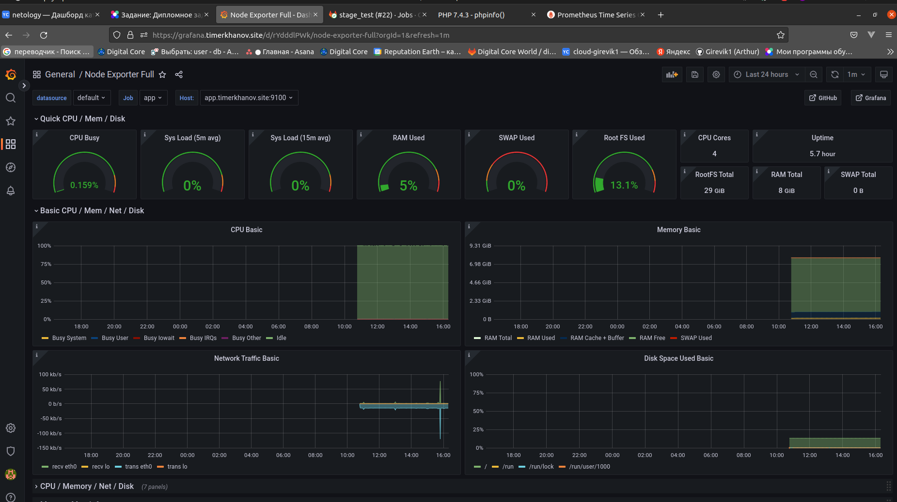
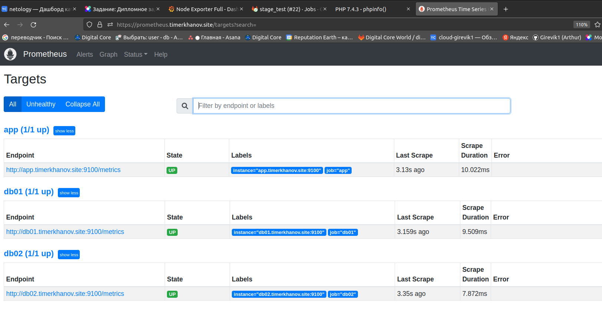

- https://netology.ru/sharing/cc2fa5788dd90a16743b165b4bb3d276


- https://netology.ru/sharing/290da9f7be7db6e1f39927e352c5b5a9
---

<div > 
    <div style="text-align: right">Автор<br>Тимерханов Артур</div><br>
    <h2 style="text-align: center">Дипломный практикум в YandexCloud</h2>
    <div style="text-align: right">
        <div>Старт работы:<br>12/09/2022</div>
        <div>Завершение работы:<br>ХХ/ХХ/2022</div>
    </div>
</div>

---
<br><h3>I. Задание по дипломной работе</h3><br>

Цели:

1. Зарегистрировать доменное имя (любое на ваш выбор в любой доменной зоне).
2. Подготовить инфраструктуру с помощью Terraform на базе облачного провайдера YandexCloud.
3. Настроить внешний Reverse Proxy на основе Nginx и LetsEncrypt.
4. Настроить кластер MySQL.
5. Установить WordPress.
6. Развернуть Gitlab CE и Gitlab Runner.
7. Настроить CI/CD для автоматического развёртывания приложения.
8. Настроить мониторинг инфраструктуры с помощью стека: Prometheus, Alert Manager и Grafana.

<br><h3>II. Требования для сдачи задания</h3><br>

1. Репозиторий со всеми Terraform манифестами и готовность продемонстрировать создание всех ресурсов с нуля.
2. Репозиторий со всеми Ansible ролями и готовность продемонстрировать установку всех сервисов с нуля.
3. Скриншоты веб-интерфейсов всех сервисов работающих по HTTPS на вашем доменном имени.
    - https://www.you.domain (WordPress)
    - https://gitlab.you.domain (Gitlab)
    - https://grafana.you.domain (Grafana)
    - https://prometheus.you.domain (Prometheus)
    - https://alertmanager.you.domain (Alert Manager)
4. Все репозитории рекомендуется хранить на одном из ресурсов (github.com или gitlab.com).

<br><h3>III. Выполение задания</h3><br>

Общая структура каталогов: 
- terraform -  каталог манифестов создания и настройки инфраструктуры
- ansible - роли, таски и настройки для деплоя и настройки на серверах необходимых сервисов
```
art@art diplom-yandexcloud$ tree -L 2
.
├── ansible
│   ├── db
│   ├── monitoring
│   ├── nginx
│   ├── node_exporter
│   └── wordpress
├── img
│   ├── res1.png
│   ├── res2.png
│   ├── res3.png
│   └── res4.png
├── README.md
└── terraform
    ├── ansible.cfg
    ├── ansible.tf
    ├── invetory.tf
    ├── machines.tf
    ├── main.tf
    ├── net.tf
    ├── outputs.tf
    ├── ssh-key
    ├── terraform.tfstate
    ├── terraform.tfstate.backup
    └── variables.tf

8 directories, 16 files
```

Скриншоты веб-интерфейсов всех сервисов работающих по HTTPS на вашем доменном имени:

`https://www.timerkhanov.site (WordPress)`


`https://gitlab.you.domain (Gitlab)`


`https://grafana.you.domain (Grafana)`



`https://prometheus.you.domain (Prometheus)`




`https://alertmanager.you.domain (Alert Manager)`


## Пояснительная записка
1. Зарегистрировал доменное имя `timerkhanov.site` на reg.ru<br>
Доменное имя делегировал на DNS YandexCloud


2. Подготовить инфраструктуру на базе облачного провайдера YandexCloud.


3. Установить Nginx и LetsEncrypt.
```
art@art nginx$ tree
.
├── nginx-letsencrypt.yml
└── roles
    └── nginx-revproxy
        ├── tasks
        │   └── main.yml
        └── templates
            ├── http.j2
            ├── https.j2
            ├── index.html
            └── nginx.conf

4 directories, 6 files
```

4. Настроить кластер MySQL.
```
art@art db$ tree
.
├── db.yml
└── roles
    ├── db-install
    │   └── tasks
    │       └── main.yml
    ├── db-setup-master
    │   ├── tasks
    │   │   └── main.yml
    │   └── templates
    │       └── mysqld.cnf
    └── db-setup-slave
        ├── tasks
        │   └── main.yml
        └── templates
            └── mysqld.cnf

9 directories, 6 files
```

Статус реплики у slave.
```
mysql> SHOW REPLICA STATUS\G;
*************************** 1. row ***************************
             Replica_IO_State: Connecting to source
                  Source_Host: 192.168.100.101
                  Source_User: wordpress
                  Source_Port: 3306
                Connect_Retry: 60
              Source_Log_File:
          Read_Source_Log_Pos: 4
               Relay_Log_File: mysql-relay-bin.000001
                Relay_Log_Pos: 4
        Relay_Source_Log_File:
           Replica_IO_Running: Connecting
          Replica_SQL_Running: Yes
              Replicate_Do_DB:
          Replicate_Ignore_DB:
           Replicate_Do_Table:
       Replicate_Ignore_Table:
      Replicate_Wild_Do_Table:
  Replicate_Wild_Ignore_Table:
                   Last_Errno: 0
                   Last_Error:
.................................
```

5. Установить WordPress.
```
art@art wordpress$ tree
.
├── roles
│   └── wordpress
│       ├── tasks
│       │   └── main.yml
│       └── templates
│           ├── wordpress.conf
│           └── wp-config.php
└── wordpress.yml

4 directories, 4 files
```

6.Развернуть Gitlab CE и Gitlab Runner.

Использовал готовые роли, разработанные geerlingguy, riemers.<br>
Хотя и использование готовых ролей это опасно, но для получения опыта работы со стороним кодом разработчиков весьма полезно.

```
art@art gitlab$ tree
.
├── ansible-role-gitlab
│   ├── defaults
│   │   └── main.yml
│   ├── handlers
│   │   └── main.yml
│   ├── LICENSE
│   ├── meta
│   │   └── main.yml
│   ├── molecule
│   │   └── default
│   │       ├── converge.yml
│   │       ├── molecule.yml
│   │       └── version.yml
│   ├── README.md
│   ├── tasks
│   │   └── main.yml
│   ├── templates
│   │   └── gitlab.rb.j2
│   └── vars
│       ├── Debian.yml
│       └── RedHat.yml
└── gitlab.yml

9 directories, 13 files
```
```
art@art gitlab$ tree
.
├── ansible-gitlab-runner
│   ├── defaults
│   │   ├── main.yml
│   │   └── main.yml123
│   ├── handlers
│   │   └── main.yml
│   ├── LICENSE
│   ├── meta
│   │   └── main.yml
│   ├── README.md
│   ├── tasks
│   │   ├── config-runner-container.yml
│   │   ├── config-runners-container.yml
│   │   ├── config-runners-windows.yml
│   │   ├── config-runners.yml
│   │   ├── config-runner-windows.yml
│   │   ├── config-runner.yml
│   │   ├── Container.yml
│   │   ├── global-setup-windows.yml
│   │   ├── global-setup.yml
│   │   ├── install-arch.yml
│   │   ├── install-container.yml
│   │   ├── install-debian.yml
│   │   ├── install-macos.yml
│   │   ├── install-redhat.yml
│   │   ├── install-windows.yml
│   │   ├── line-config-runner-windows.yml
│   │   ├── line-config-runner.yml
│   │   ├── main.yml
│   │   ├── register-runner-container.yml
│   │   ├── register-runner-windows.yml
│   │   ├── register-runner.yml
│   │   ├── section-config-runner-windows.yml
│   │   ├── section-config-runner.yml
│   │   ├── systemd-reload.yml
│   │   ├── Unix.yml
│   │   ├── update-config-runner-windows.yml
│   │   ├── update-config-runner.yml
│   │   └── Windows.yml
│   ├── tests
│   │   ├── files
│   │   │   └── mock_gitlab_runner_ci.py
│   │   ├── inventory
│   │   ├── test.yml
│   │   ├── travis-bootstrap-ansible.ps1
│   │   └── vars
│   │       ├── default.yml
│   │       └── Windows.yml
│   └── vars
│       ├── Archlinux.yml
│       ├── Darwin.yml
│       ├── Debian.yml
│       ├── default.yml
│       ├── main.yml
│       ├── RedHat.yml
│       └── Windows.yml
└── runner.yml

9 directories, 48 files
```

6. Настроить CI/CD для автоматического развёртывания приложения.

Чтобы установить runner на машине нужен ключ(токен), который берем из консоли gitlab.


Прописал в глобальную переменную закрытый ключ с машинны runner, 
настроил пайп, использовал эту переменную там


Список пайпов, которые отрабатывали по коммитам. В начале были трудности, но шаг за шагом получилось.


7. Настроить мониторинг инфраструктуры с помощью стека: Prometheus, Alert Manager и Grafana.


Через импорт использовал дашборд id 1860 для prometheus.

